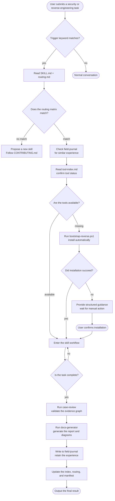
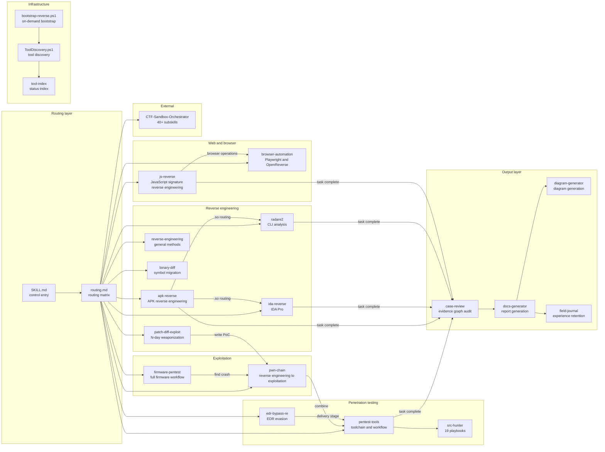
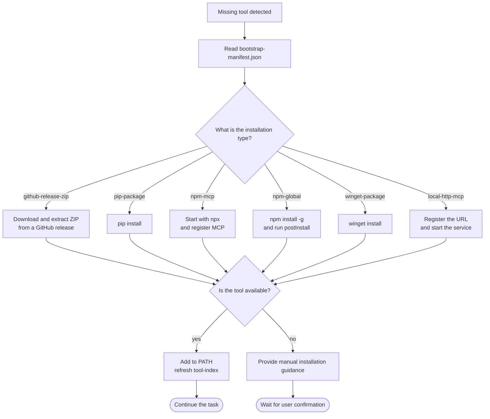
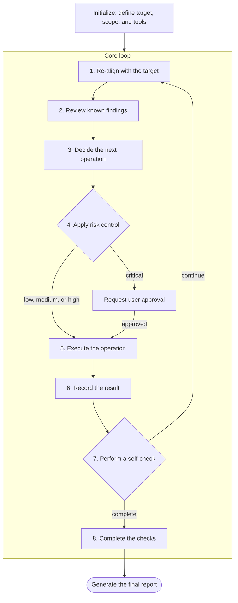
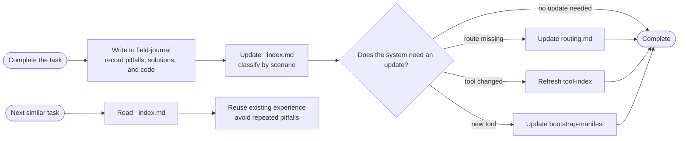
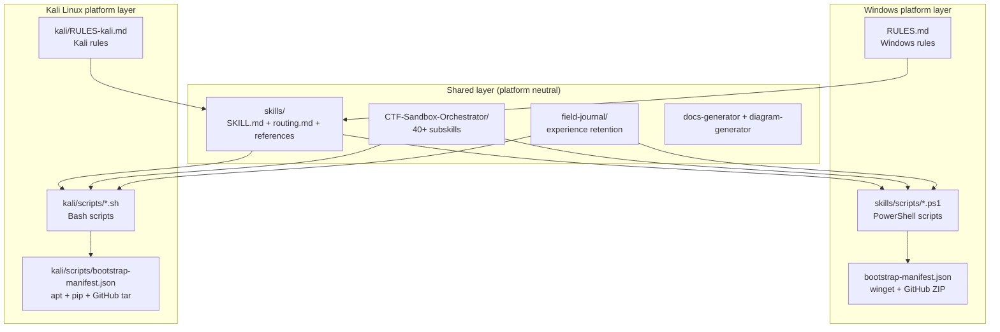
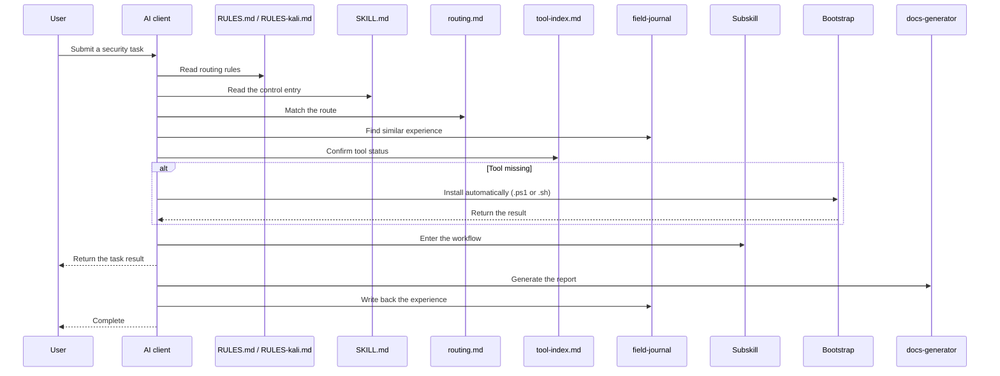

# System Architecture

## Complete Behavior Chain Flowchart

## Skills Module Relationship Diagram

## Bootstrap Process

## Penetration Testing Loop

## Automatic Evolution Mechanism

## Multi-Platform Support Architecture

### Platform Selection Logic

| Environment | Rules file | Scripts | Package management |
|------|--------------|-----------|--------|
| Windows | `RULES.md` | `skills/scripts/*.ps1` | winget / GitHub release ZIP |
| Kali Linux | `kali/RULES-kali.md` | `kali/scripts/*.sh` | apt / pip / npm / GitHub tar.gz |

### Kali Edition Features

- **Many tools are preinstalled**: nmap, sqlmap, hashcat, hydra, metasploit, radare2, binwalk, and burpsuite need no bootstrap.
- **Unified apt management**: No winget or manual ZIP extraction is required.
- **Native Bash**: The scripts have no PowerShell dependency.
- **Standard paths**: `/usr/bin/`, `/opt/`, and `~/tools/` avoid drive-letter and space issues.

## File Reading Sequence Diagram

