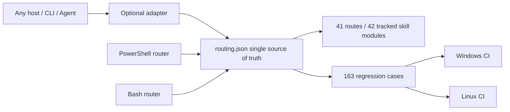

# Local Review and Integration Report for PRs #43, #37, #36, and #23

- Date: 2026-08-08
- Baseline: `origin/main` at `6315d02`
- Review branch: `codex/review-pr-43-37-36-23`
- Scope: review only the incremental value of the four PRs against the current mainline. Do not act on external targets.
- Conclusion: all four PRs provide reusable value, but only #43 and #37 should retain their main structure. Integrate #36 and #23 selectively.

## Executive Summary

| PR | Value against mainline | Integration decision | Key boundary |
|---|---|---|---|
| #43 | Very high | Keep structured routing, 163 current regression cases, dual-platform CI, the supply-chain pin gate, and the dynamic index. | Remove OpenCode configuration, the installer, and the dedicated adapter. The core must not bind to any client. |
| #37 | High | Merge case-review, evidence-graph audit, hash checks, and tests. Add R40. | Accept both `done` and the current `completed` convention. |
| #36 | Medium-high | Selectively merge Burp reconnect and newline-message handling, atomic tokens, Anything Analyzer authorization, process-tree fixes, and sudo-home fixes. | Reject a semantic fallback that marks every capability as ready. |
| #23 | Medium as a package, low as a whole | Merge only Bash case-init, case-guard, structured Bash routing, and CI parity. | Exclude client lists, GIFs, demonstration output, and hard-coded routing copies from the 92 files. |

## Platform Boundary

Structured routing has one source of truth: `skills/config/routing.json`. PowerShell and Bash entry points read it. Host clients can exist only as optional adapters. They must not determine repository identity, routing rules, test baselines, or installation paths.

## Review Findings and Corrections

1. #43 gains its design value from structured data and automated gates, not OpenCode integration. The implementation removed all OpenCode-specific files and CI jobs.
2. The original #37 implementation recognized only `done`. It misclassified the mainline `completed` value as incomplete. The implementation added compatibility and test 7.
3. The #36 bridge reconnect and token writing provide net gains. Its capability-state rewrite could create false positives, so the implementation did not merge it.
4. The #23 Bash router copied a hard-coded table. It would immediately drift from #43's R40 and priority values. The implementation now reads `routing.json` and checks R1 and R3 and R40 parity in CI.
5. The new supply-chain gate exposed seven floating installation sources in the Kali manifest. The implementation pinned Frida 14.10.4, the IDA MCP commit, Agent Browser 0.31.1, the ProxyCat commit, Nuclei v3.8.0, and pwntools 4.15.0. The installation commands now use these pins.
6. A post-push review found that Bash `case-init` did not inherit the CaseName path constraint. The implementation now rejects paths, control characters, wildcards, and trailing dots or spaces. CI includes negative cases.
7. Bash previously classified an authorized URL as `offline` and could mark it ready. The implementation now matches PowerShell with `authorized_target_only`. Offline mode accepts local samples only.
8. Bash `case-guard` now reads values only from the `auth`, `network_profile`, and `signoff` sections. Notes and evidence cannot provide substitute fields.
9. Fixed-source ProxyCat installation on Kali now creates a detectable `~/.local/bin/proxycat` wrapper. CI checkout also uses the v4.2.2 commit instead of a moving tag.
10. A dynamic INDEX on a development machine previously included 12 local modules excluded by `.gitignore`. A clean clone would fail. The generator now enumerates only Git-tracked skills. A clean clone and a workspace with private extensions both contain 42 core modules.

## Quantified Improvement over the Old Mainline

The same 163 cases called the old hard-coded router and the new structured router in separate PowerShell processes:

| Version | Passed | Accuracy | No output |
|---|---:|---:|---:|
| Old mainline `6315d02` | 137 / 163 | 84.05% | 0 |
| Current structured implementation | 163 / 163 | 100% | 0 |

The new implementation adds 26 correct routes and improves accuracy by 15.95 percentage points. Improvements cover Frida and Android, certificate and root detection, packet capture and request replay, ransomware, Burp and Metasploit, Go binaries, BLE, USB, native `.so`, and memory dumps. The old implementation routed these cases to R0.

## Verification Results

| Verification | Result |
|---|---|
| Full structured-routing regression | 163 / 163 passed |
| Routing coherence and supply-chain pin gate | Passed |
| PowerShell smoke test | Passed |
| P0 friction and scope-guard regression | Passed |
| Old and new 163-case A/B test | 137/163 → 163/163 |
| case-review Python tests | 7 / 7 passed |
| Burp bridge Node regression | 1 / 1 passed |
| Bash router, case-init, and case-guard parity | Passed |
| PowerShell and Bash syntax plus JSON parsing | Passed |
| Java compilation check | Gradle 8.7 distribution download was blocked by local certificate-revocation network errors. Compilation of the changed Java source passed with Maven Central dependencies and JDK 21. |

## Remaining Risks

- Structured Bash routing depends on Python 3. This dependency is explicit and avoids a second routing table.
- Pinned dependency versions require periodic, explicit upgrades. They no longer follow `latest` implicitly.
- Client adapters can expand, but core data and tests must remain host-independent.
- The local machine did not complete Gradle task tests. A 128 MB wrapper download was blocked by certificate-revocation network errors and a slow link. An independent compilation check with matching dependencies verified the changed Java source.

## Final Recommendation

Merge the selective result from the current review branch. Do not merge the original four PR packages. Future PRs should separate core routing, host adapters, demonstration assets, and documentation. This structure supports independent review and rollback.
