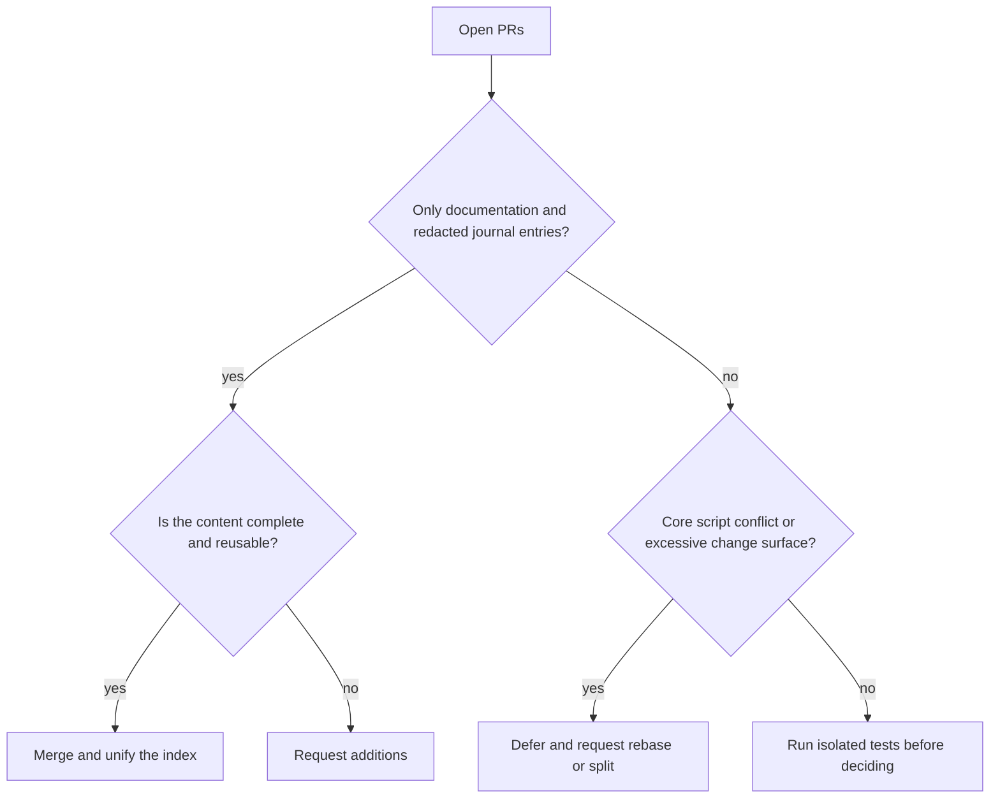

# Open PR Value Assessment and Merge Report — 2026-08-08

## Conclusion

Based on the latest `origin/main`, this review covered eight open PRs. This round merged #59, #19, #22, and #29. It deferred #43, #37, #36, and #23. The smoke and routing-coherence checks passed after the merges.

## Assessment Results

| PR | Value | Risk or status | Decision |
|---|---|---|---|
| #59 | Complete Rust cdylib differential-reproduction method with high reuse value | Journal and index only. No executable code. | Merge |
| #19 | Broad Windows 24H2 toolchain compatibility experience | Journal and index only. | Merge |
| #22 | Complete Electron, Bytenode, and update-chain analysis method | Journal and index only. | Merge |
| #29 | Complete experience rebuilding a Next.js dual-API serializer and contract | Journal and index only. | Merge |
| #43 | High value from a single routing source of truth, regression cases, CI, and version pins. Client integration can only be an optional adapter. | 38 files conflict with four key mainline files. The original proposal includes OpenCode-specific configuration. | Defer. Request a focused review after rebase. The core must not bind to OpenCode. |
| #37 | Evidence graph and case review can complete the delivery audit. | Conflicts with mainline routing checks and documentation. | Defer. Rebase separately and run its unit tests. |
| #36 | Correct direction for MCP and bootstrap security hardening. | Six key files conflict. Recent mainline changes already include some capabilities. | Defer. Remove duplicate changes. |
| #23 | Bash parity and demonstration materials provide ecosystem value. | 92 files, many demonstration assets, and two script conflicts. | Defer. Split the PR. |

## Decision Diagram

## Verification

- `skills/scripts/smoke.ps1`: ALL PASS. Nine scripts parsed and eight routing cases passed.
- `skills/scripts/verify-routing-coherence.ps1`: ALL ROUTING COHERENCE CHECKS PASSED.
- The user's existing uncommitted journal was isolated with a stash during synchronization and merging, then restored.

## Follow-Up Recommendations

1. Rebase #43 onto the current `main`. Review JSON routing equivalence, the supply-chain pin gate, and cross-platform paths.
2. Rebase #37 separately and run `skills/case-review/tests/test_review_case.py`.
3. Compare #36 with the merged security fixes file by file. Keep only uncovered tests or boundary handling.
4. Split #23 into three independent PRs: Bash parity, plugin metadata, and demonstration assets.
