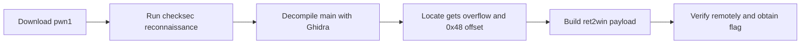

# ctf-demo — Final Report (Example)

> This report structure follows `skills/docs-generator/references/security-report-templates.md`.

## 1. Overview

| Item | Value |
|----|----|
| Target | pwn1 (https://ctf.example.com/challenges/pwn1) |
| Type | CTF pwn (stack overflow) |
| Result | ✅ flag captured |
| Duration | ~1.5h |

## 2. Executive summary

pwn1 is a 64-bit ELF without PIE or a canary. `main` uses `gets()` to read a 0x40-byte buffer.
A 0x48-byte offset overwrites the return address and calls the program's `win` function to obtain the flag. Remote verification succeeded.

## 3. Timeline

See `timeline.md` for five stages: init → recon → static → exploit → wrap.

## 4. Finding

### F-01

- title: gets() stack overflow in main (ret2win)
- severity: high
- status: validated
- confidence: high
- evidence_ids: [E-001, E-002, E-003]
- location: pwn1:main — gets() into buf[0x40], return offset 0x48, no canary
- impact: Remote code execution as the pwn1 process user. The impact is flag disclosure in the CTF context.
- repro_steps:
  1. Triage the binary (E-001).
  2. Confirm the overflow offset with a cyclic crash test (E-002).
  3. Send the ret2win payload to the remote service (E-003).
- remediation: Replace gets() with fgets/read. Enable a canary, PIE, and full RELRO. Rely on ASLR.

## 5. Attack path (Evidence → Finding → Path)

### P-01

- title: pwn1 ret2win solve path
- path_type: solve
- start: challenge binary download
- goal: flag capture
- steps:
  1. action: download and triage pwn1 — evidence: E-001 — finding: F-01 | none
  2. action: decompile main and confirm gets() overflow — evidence: E-002 — finding: F-01
  3. action: craft ret2win payload and verify remotely — evidence: E-003 — finding: F-01
- residual_risks: none (isolated CTF lab)



## 6. Reproduction

```bash
python3 exploit.py REMOTE
```

## 7. Remediation (for a real application)

- Replace `gets` with `fgets` or `read`.
- Enable a canary, PIE, and full RELRO.
- Deploy ASLR on the server.

## 8. Notes

- The field-journal entry is redacted and contains no real target information.
